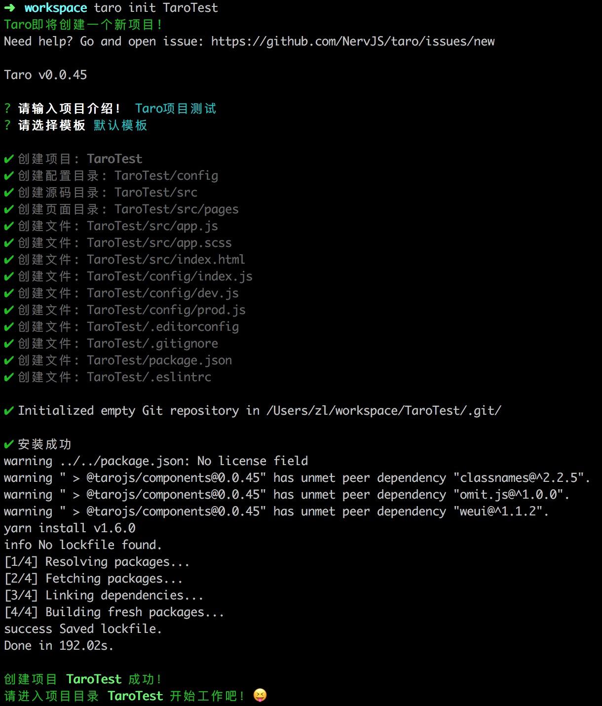

# Taro 学习笔记

官网：[https://taro.aotu.io/](https://taro.aotu.io/)

项目地址：[https://github.com/NervJS/taro](https://github.com/NervJS/taro)

## 简介

Taro 是凹凸实验室出品的一套 React 语法规范的多段开发解决方案。主旨在于使用一套代码，通过不同的编译类型，编译为成不同平台的应用。（目前支持：小程序、H5）

## 环境搭建

### 安装

安装 Taro 提供的 cli 工具。

```
// npm
-> npm install -g @tarojs/cli
// yarn
-> yarn global add @tarojs/cli
```

### 使用

新建项目

```
-> trao init projectName
```



编译预览（微信小程序）

```
# npm script
-> npm run dev:weapp
# 仅限全局安装
-> taro build --type weapp --watch
# npx用户也可以使用
-> npx taro build --type weapp --watch
```


编译预览（H5）

```
# npm script
-> npm run dev:h5
# 仅限全局安装
-> taro build --type h5 --watch
# npx用户也可以使用
-> npx taro build --type h5 --watch
```


## 项目相关

项目目录结构

```
├── dist                   编译结果目录
├── config                 配置目录
|   ├── dev.js             开发时配置
|   ├── index.js           默认配置
|   └── prod.js            打包时配置
├── src                    源码目录
|   ├── pages              页面文件目录
|   |   ├── index          index页面目录
|   |   |   ├── index.js   index页面逻辑
|   |   |   └── index.css  index页面样式
|   ├── app.css            项目总通用样式
|   └── app.js             项目入口文件
└── package.json
```

入口文件：`app.js`

## 生命周期对应关系

程序生命周期与小程序生命周期对应关系：

- componentWillMount ==> onLaunch
- componentDidMount ==> onLaunch 在 componentWillMount 后执行
- componentDidShow ==> onShow
- componentDidHide ==> onHide

页面生命周期与小程序页面生命周期对应关系：

- componentWillMount ==> onLoad
- componentDidMount ==> onReady
- componentWillUnmount ==> onUnload
- componentDidShow ==> onShow
- componentDidHide ==> onHide

页面小程序专属方法：

- onPullDownRefresh
- onReachBottom
- onShareAppMessage
- onPageScroll
- onTabItemTap

## API

Taro 本身提供的 API。

**Taro 本身提供的基础 API**

- Component：所有组件类的基类
- Events：消息机制
- eventCenter：全局消息中心
- ENV_TYPE：环境值，常量，可直接使用
- getEnv：获取当前环境

**网络相关**

- request：网络请求方法
- uploadFile：上传方法
- downloadFile：下载方法

**Socket相关**

- connectSocket：创建 WebSocket 
    - onOpen：打开时方法
    - onError：出错是方法
    - send：发送消息
    - onMessage：接收消息
    - close：关闭
    - onClose：关闭时方法

**媒体相关**（2016-06-13新增）

- 图片相关
    - chooseImage：选择图片
    - previewImage：预览图片
    - getImageInfo：获取图片信息
    - saveImageToPhotosAlbum：保存图片到相册
- 录音相关
    - startRecord：开始录音
    - stopRecord：停止录音
    - getRecorderManager：获取录音管理器
- 音频相关
    - playVoice：播放音频
    - pauseVoice：暂停播放音频
    - stopVoice： 停止音频
    - getBackgroundAudioManager：获取背景音频管理器
    - createAudioContext：创建auto上下文对象并返回
    - createInnerAudioContext：createAudioContext升级版
- 音乐相关
    - getBackgroundAudioPlayerState：获取后台音乐播放状态
    - playBackgroundAudio：播放背景音乐
    - pauseBackgroundAudio：暂停背景音乐
    - seekBackgroundAudio：控制音乐播放进度
    - stopBackgroundAudio：停止背景音乐
    - onBackgroundAudioPlay：监听音乐播放
    - onBackgroundAudioPause：监听音乐暂停
    - onBackgroundAudioStop：监听音乐停止
- 视频相关
    - chooseVideo：选择视频
    - saveVideoToPhotosAlbum：保存视频到相册
    - createVideoContext：创建并返回视频上下文对象
- 相机相关
    - createCameraContext：创建并返回相机上下文对象

**Stroage相关**

- setStorage：设置本地存储
- setStorageSync：设置本地存储（同步方法）
- getStorage：获取本地存储
- getStorageSync：获取本地存储（同步方法）
- getStorageInfo：获取本地存储信息
- getStorageInfoSync：获取本地存储信息（同步方法）
- removeStorage：删除本地存储
- removeStorageSync：删除本地存储（同步方法）
- clearStorage：清除本地存储
- clearStorageSync：清除本地存储（同步方法）

**界面操作相关**

- showToast：展示toast提示
- hideToast：隐藏toast提示
- showLoading：展示加载
- hideLoading：隐藏加载
- showModal：展示模态框
- showActionSheet：展示操作选项

**路由相关**

- navigateTo：跳转页面
- redirectTo：页面重定向
- navigateBack：返回

**WXML节点相关**

- createSelectorQuery：创建一个节点选择器
    - in：更改选择器的选取范围
    - select：选择匹配节点
    - selectAll：选择所有匹配节点
    - selectViewport：选择显示区域
    - boundingClientRect：返回添加节点的布局位置，相对于显示区域，以像素为单位
    - scrollOffset：返回添加节点的滚动位置，以像素为单位
    - fields：获取节点相关信息
    - exec：执行所有的请求

## 组件

**基础**

- Icon：图标
- Text：文本
- Progress：进度条
- RichText：富文本编辑器（2016-06-13新增）

**视图容器**

- View：视图容器
- ScrollView：可滚动视图容器
- Swiper：滑块视同容器
- MovableView：可移动视图容器（2016-06-13新增）
- CoverView：可覆盖原生组件的文本视图（2016-06-13新增）

**表单组件**

- Button：按钮
- CheckBox：多选
- Radio：单选
- Switch：开关
- From：表单
- Label：标签
- Input：输入框
- Textarea：文本域
- Picker：选择器
- PickerView：暂不知有何用处
- Silder：滑块选择器

**导航**

- Navigator：导航链接

**媒体**

- Audio：音频
- Image：图片
- Video：视频
- Camera：相机

**地图**（2016-06-13新增）

- Map：地图

## 需要注意的地方

**设计尺寸**

Taro 建议使用 `px` 、 `百分比 %`。 Taro 的换算标准尺寸为 `750px`。 如果需要修改，修改配置文件中的 `designWidth` 属性即可。

**大小写敏感**

Taro 会对 `px` 进行单位转换，但是不会对 `Px` 或者 `PX` 进行转换。

**静态资源引用**

可以通过 ES6 的模式引用静态资源。

**组件命名规则**

使用首字母大写的驼峰命名法（Camel-Case）对组件进行命名。

**事件名称**

- 事件名称采用驼峰写法，而不是全部小写。
- 给事件传递参数必须通过 `bind` 方法
- 任何组件的时间传递都要以 `on` 开头
- 事件对象总是咋方法参数的最后一个

**条件渲染**

条件渲染可以使用以下几种方式：

- 元素变量
- 逻辑运算符 `&&`
- 三元运算符

**state**

- 不能直接更新状态
- 状态更新一定是异步的
- state 更新会被合并

## 与 React 不同的地方

**props**

- 不同通过 props 传递 JSX 元素。
- 自定义组件不能嵌套子元素
- 原生组件可以嵌套子元素

**编译后的元素对象**

React 中 JSX 会编译成普通的 JS 执行，每个元素通过 `createElement` 函数创建，所有可以在 map 遍历后在进行过滤。 但是在 Taro 中， JSX 会被编译成微信小程序的模板字符串，所有不能把 map 遍历后的模板当成一个数组来处理。如果需要过滤，请先使用过滤，在进行遍历生成。