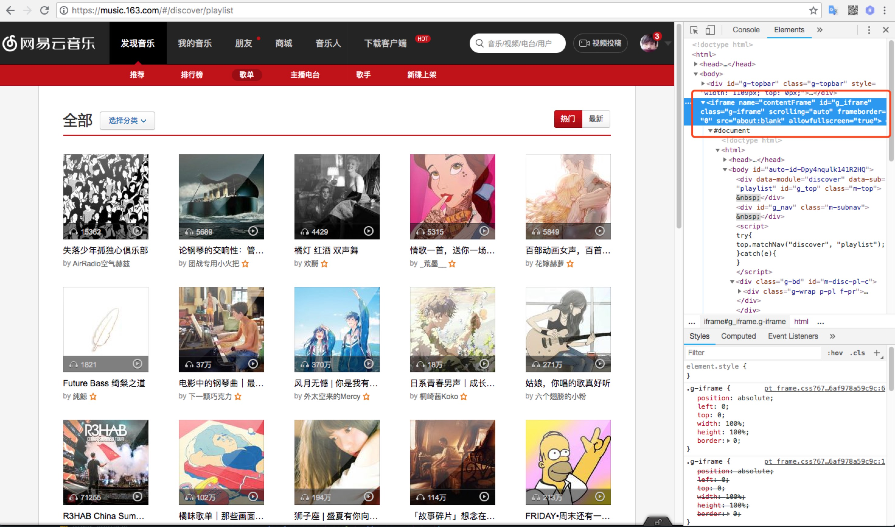
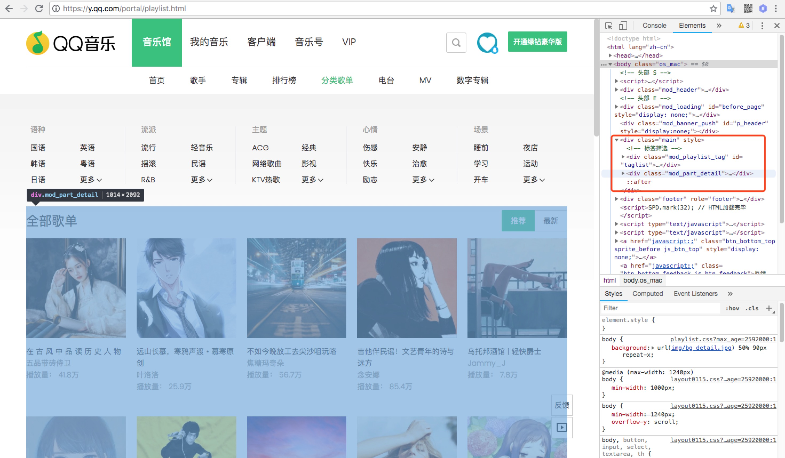

# 使用Puppeteer轻松爬取网易云音乐、QQ音乐的精品歌单

## 背景

最近在学习Puppeteer进行自动化操作，另一方面为了防止上班时间被打扰，是时候爬点歌单在上班的时候，用来抵抗外界的干扰了。

## 地址

项目完整代码地址：[https://github.com/BingKui/WeChatScheduleSpider](https://github.com/BingKui/WeChatScheduleSpider)

## 工具

- NodeJS：基本环境 版本 >= `v10.*.*`
- Puppeteer：Google官方出品的无头Chrome node库
- MongoDB：用来存储爬取到的数据
- mongoose：node 中链接、操作 MongoDB 的驱动库
- dayjs：时间处理库
- node-schedule：node 定时任务库，线上部署用到，本地本地没有用到
- pm2：node 进程管理工具，线上部署使用

## 目标

- 爬取网易云音乐播放量超过 1000W 的歌单
- 爬取 QQ 音乐播放量超过 1000W 的歌单
- 把爬取的歌单保存到数据库
- 创建定时任务，线上部署，每天定时爬取、保存

## 准备工作

- 保证本地安装了 MongoDB 数据库，并能正常连接，具体请自行百度。
- 安装所需的库文件
- 编写数据库连接文件

### 安装库文件注意

由于 Puppeteer 会下载一个 Chrome 浏览器到本地，所以可能较慢，可以使用 `cnpm` 或者切换为 淘宝镜像。

### 数据库连接文件

```
const mongoose = require('mongoose');
// 数据库地址
const mongoDB = 'mongodb://127.0.0.1:27017/wechat';

// 链接数据库
mongoose.connect(mongoDB);

// 监听数据库事件
const db = mongoose.connection;

// 连接异常
db.on('error', function (err) {
    console.log('Mongoose connection error: ' + err);
});

// 连接断开
db.on('disconnected', function () {
    console.log('Mongoose connection disconnected');
});

// 连接成功
db.on('connected', function () {
    console.log('Mongoose connection open to ' + mongoDB);
});
```

## 爬取网易云音乐歌单

### 创建浏览器对象

首先我们创建一个无头的浏览器对象。

```
const browser = await puppeteer.launch({timeout: 300000, headless: true, args: ['--no-sandbox']});
```

具体参数含义请[点解这里查看](https://github.com/GoogleChrome/puppeteer/blob/v1.6.0/docs/api.md#puppeteerlaunchoptions)。

> 说明：args 参数为可选项，以上参数是为了兼容 CentOS ，添加的参数

### 打开页面

打开地址：`https://music.163.com/#/discover/playlist`。

```
let url = 'https://music.163.com/#/discover/playlist';
// 创建
const page = await browser.newPage();
// 跳转到歌单页面
await page.goto(url);
```

### 分析页面结构



网易云音乐的歌单页使用了 `iframe` 嵌套的方式，所以我们要在页面中获取到 `iframe` 中的内容，并提取我们需要的信息。

```
// 获取歌单的iframe
let iframe = await page.frames().find(f => f.name() === 'contentFrame');
```

### 获取歌单数据的元素并处理

Puppeteer 提供了可以在 `iframe` 中执行js的方法，我们可以直接执行，通过原生js来获取想要的数据。

```
// 获取歌单
const result = await iframe.evaluate(() => {
    // 获取所有元素
    const elements = document.querySelectorAll('#m-pl-container > li');
    // 创建数组，存放获取的数据
    let res = [];
    for (let ele of elements) {
        let image = ele.querySelector('.j-flag').getAttribute('src');
        let name = ele.querySelector('.tit').innerText;
        let count = ele.querySelector('.nb').innerText;
        let author = ele.querySelector('.nm').innerText;
        let address = 'https://music.163.com/#' + ele.querySelector('.msk').getAttribute('href');
        const flag = (count.indexOf('万') > -1) && (parseInt(count.split('万')[0]) > 1000);
        if (flag) {
            res.push({
                image,
                name,
                count,
                author,
                address,
                from: 'netease',
            });
        }
    }
    // 返回数据
    return res;
});
```

### 循环爬取所有热门歌单

通过分析页面可以看到，歌单一共 35 页，并且每页有 35 条数据，并且分页是通过 url 参数区分的，所以我们可以简单暴力一点，写个循环搞定（主要还是懒）。

> 高级操作：可以通过 Puppeteer 的方法，获取页面，然后点击下一页，判断是否能够点击下一页来确定是否存在下一页。需要了解的可以自行研究。

为了方便操作，我们把获取每页数据封装成一个方法：`getOnePageData`。

```
const getOnePageData = async (page, pageNumber) => {
    const url = `https://y.qq.com/portal/playlist.html#t3=${pageNumber}&`;
    // 跳转到页面
    await page.goto(url);
    await page.setViewport({ 
        width: 1300, 
        height: 5227,
    });
    // 等待两秒，加载图片
    await page.waitFor(2000);
    // 获取歌单
    const result = await page.evaluate(() => {
        // 此处与上方方法一样，省略
        ...
    });
    return result;
}
```

然后循环获取数据。

```
// 定于数组存储数据
let musicPlayList = [];
const page = await browser.newPage();
for (let i = 0; i < 1191; i += 35) {
    const item = await getOnePageData(page, i);
    console.log(`获取到数据${item.length}条。`);
    musicPlayList = musicPlayList.concat(item);
}
```

### 保存数据到 MongoDB 数据库

定义数据模型。

```
// models/music.js
const mongoose = require('mongoose');
const Schema = mongoose.Schema;

const MusicSchema = new Schema({
    image: String,
    name: String,
    count: String,
    author: String,
    address: String,
    from: String,
    date: Date,
    show: Boolean, // 是否展示
});

const MusicModel = mongoose.model('playlist', MusicSchema);

module.exports = MusicModel;
```

封装基本的添加方法。

```
// server/music.js
const MusicModel = require('../models/music.js');

const save = (item) => {
    findBuName(item.name, (obj) => {
        if (obj) {
            console.log('已经保存，数据');
            obj.remove();
        }
        const saveObject = new MusicModel(item);
        saveObject.save((err) => {
            if (err) return handleError(err);
        });
    });
}

const findBuName = (name, callback) => {
    MusicModel.findOne({name}, (err, item) => {
        if (err) {
            callback && callback(false);
        }
        callback && callback(item);
    });
};

module.exports = {
    save,
};
```

由于爬取的数据存在重复的数据，为了减少不必要的资源浪费，保存前先进行数据的去重。

```
// 保存之前去重
let hash = {};
musicPlayList = musicPlayList.reduce((item, next) => {
    hash[next.address] ? '' : hash[next.address] = true && item.push(next);
    return item
}, []);
```

保存数据到 MongoDB 数据库。

```
const MusicServer = require('../server/music.js');

// 保存数据
for (let i = 0; i < musicPlayList.length; i++) {
    const item = musicPlayList[i];
    item.date = dayjs().format('YYYY-MM-DD HH:mm:ss');
    item.show = true;
    MusicServer.save(item);
}
```

### 最后关闭浏览器

最后别忘了关闭开始的时候创建的浏览器。

```
browser.close();
```

到这里，爬取网易云音乐的精品歌单已经完成了。接下来开始爬取 QQ 音乐。

## 爬取 QQ 音乐精品歌单

由于爬取方式基本一样，下面只介绍不同的地方。

### 分析页面结构



分析页面，QQ 音乐，没有采用和网易云音乐一样的 `iframe` 方式，这样爬取更加简单。

### 获取歌单数据的元素并处理

可以通过在页面上执行方法就能够爬取到我们需要的数据。

```
// 获取歌单
const result = await page.evaluate(() => {
    const elements = document.querySelectorAll('#playlist_box > li');
    let res = [];
    for (let ele of elements) {
        const _n = ele.querySelector('.js_playlist');
        let image = 'https:' + ele.querySelector('.playlist__pic').getAttribute('src');
        let name = _n.getAttribute('title');
        let count = ele.querySelector('.playlist__other').innerText.split('：')[1].replace(/\s+/g, '');
        let author = ele.querySelector('.playlist__author').innerText.replace(/\s+/g, '');
        let address = `https://y.qq.com/n/yqq/playsquare/${_n.getAttribute('data-disstid')}.html#stat=${_n.getAttribute('data-stat')}`;
        const flag = (count.indexOf('万') > -1) && (parseInt(count.split('万')[0]) > 1000);
        if (flag) {
            res.push({
                image,
                name,
                count,
                author,
                address,
                from: 'qq'
            });
        }
    }
    return res;
});
```

### 循环爬取数据

由于 QQ 音乐采取的分页方式和网易云音乐一样，所有我们还使用相同的方法，暴力爬取（可见我是有多懒~~）。

找到页面中一共有多少页歌单，然后写个像下面的循环。

```
// 定于数组存储数据
let musicPlayList = [];
const page = await browser.newPage();
// 爬取是总歌单也为 120 页
for (let i = 1; i < 120; i++) {
    const item = await getOnePageData(page, i);
    console.log(`获取到数据${item.length}条。`);
    musicPlayList = musicPlayList.concat(item);
}
```

然后像上边一样，保存进数据库就可以了。

## 定时任务

由于每天歌单都会有大量的播放量，不断的更新，因此写个定时任务，每天定时爬取更新数据才是稳妥的方法，能够保证我们的数据最新。

### 封装爬取方法

把爬取方法封装成模块方法，然后在固定的时候调用执行爬虫。

```
// qq.js
const QQMusic = async () => {
    const browser = await puppeteer.launch({timeout: 300000, headless: true, args: ['--no-sandbox']});
    // 定于数组存储数据
    let musicPlayList = [];
    const page = await browser.newPage();
    for (let i = 1; i < 120; i++) {
        const item = await getOnePageData(page, i);
        console.log(`获取到数据${item.length}条。`);
        musicPlayList = musicPlayList.concat(item);
    }
    // 保存之前去重
    let hash = {};
    musicPlayList = musicPlayList.reduce((item, next) => {
        hash[next.address] ? '' : hash[next.address] = true && item.push(next);
        return item
    }, []);
    
    MusicServer.updateAllHide(() => {
        // 保存数据
        for (let i = 0; i < musicPlayList.length; i++) {
           const item = musicPlayList[i];
           item.date = dayjs().format('YYYY-MM-DD HH:mm:ss');
           item.show = true;
           MusicServer.save(item);
       }
    }, { from: 'qq' });

    await browser.close();
};
module.exports = QQMusic;

// netease.js
const NeteaseMusic = async () => {
    const browser = await puppeteer.launch({timeout: 300000, headless: true, args: ['--no-sandbox']});
    // 定于数组存储数据
    let musicPlayList = [];
    const page = await browser.newPage();
    for (let i = 0; i < 1191; i += 35) {
        const item = await getOnePageData(page, i);
        console.log(`获取到数据${item.length}条。`);
        musicPlayList = musicPlayList.concat(item);
    }

    // 保存之前去重
    let hash = {};
    musicPlayList = musicPlayList.reduce((item, next) => {
        hash[next.address] ? '' : hash[next.address] = true && item.push(next);
        return item
    }, []);

    MusicServer.updateAllHide(() => {
        // 保存数据
        for (let i = 0; i < musicPlayList.length; i++) {
           const item = musicPlayList[i];
           item.date = dayjs().format('YYYY-MM-DD HH:mm:ss');
           item.show = true;
           MusicServer.save(item);
       }
    }, { from: 'netease' });

    await browser.close();
};
module.exports = NeteaseMusic;
```

### 编写定时器

应用 `node-schedule` 模块，我们能够简单的创建定时任务。

```
// 创建爬取歌单定时任务
const qqPlayList = () => {
    TimeSchedule.scheduleJob('0 5 0 * * *', async () => {
        await QQMusic();
    });
}

const neteasePlayList = () => {
    TimeSchedule.scheduleJob('0 50 0 * * *', async () => {
        await NeteaseMusic();
    });
}

const scheduleList = () => {
    qqPlayList();
    neteasePlayList();
};

scheduleList();
```

注意两个爬虫之间的时间间隔，尽量大一些，方式同时两个爬虫都运行，造成服务器的过大压力（土豪机，请随意~~~）。

## 线上部署

使用 `pm2` 我们可以方便的管理我们的 NodeJS 服务。

安装 pm2

```
npm install -g pm2
```

使用 `pm2` 启动我们的服务。

```
pm2 start index.js
```

更多相关内容请查阅[这里](http://pm2.keymetrics.io/)。

## 预告

接下来就是使用爬到的数据生成图片了，先来两张，看看效果。敬请期待！！！


