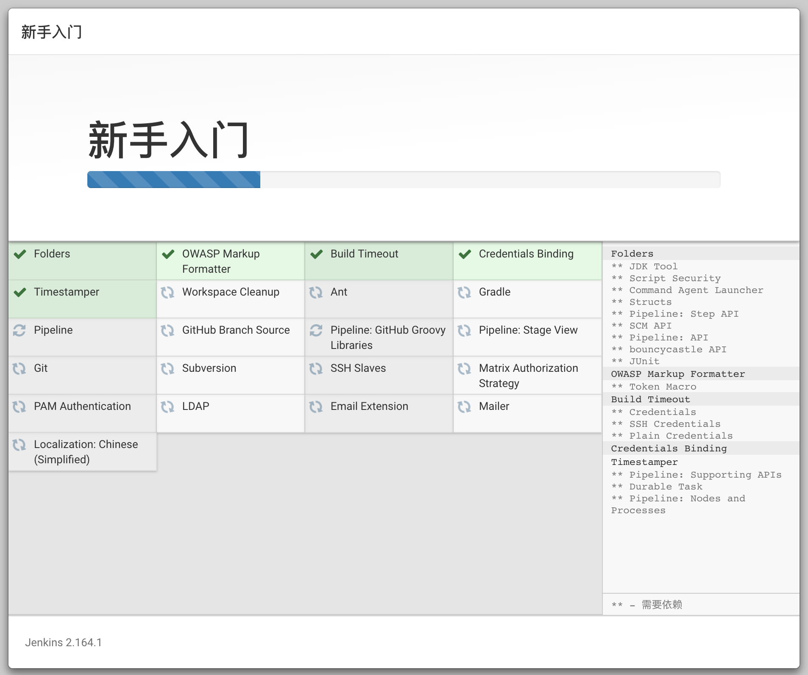

# 前端er，Jenkins持续化集成环境搭建

> 作为一个有追求的前端er，也为了解放双手，加快自动化的步伐，推动项目的持续集成。当然需要知道怎么搭建持续化集成环境了。

## 系统环境准备

> 模拟真实的服务器操作方式，使用虚拟机的方式来部署我们的 Jenkins 环境

### 操作环境

- 电脑：MacBook Pro
- 系统：macOS Mojave 10.14.1

### 虚拟机环境

- 系统：CentOS Linux release 7.4.1708 (Core)
- JDK：1.8.0
- Jenkins：2.164.1

## 用到的软件软件

> 以下软件为我使用的软件，可以使用相同功能的代替

- Parallels Desktop：模拟器软件
- iTerm2：命令行工具
- zsh：shell工具
- Oh My ZSH：zsh扩展

## 系统基础环境搭建

### 安装zsh

```shell
sudo yum install -y zsh
```

### 安装git

```shell
sudo yum install -y git
```

### 安装oh-my-zsh

> oh-my-zsh 对 git 和 zsh 存在依赖需要确保安装的时候这两个已经安装。

```shell
sh -c "$(curl -fsSL https://raw.github.com/robbyrussell/oh-my-zsh/master/tools/install.sh)"
# 或者
sh -c "$(wget https://raw.github.com/robbyrussell/oh-my-zsh/master/tools/install.sh -O -)"
```


### 安装Java环境

> Jenkins 对 Java 环境为强依赖，必须保证安装 Jenkins 前，安装了 Java 环境。

查询JDK信息：

```shell
yum search java-1.8
```


安装JDK：

```shell
sudo yum install -y java-1.8.0-openjdk-devel.x86_64
```

设置环境变量：

```shell
/usr/lib/jvm/java-1.8.0-openjdk-1.8.0.201.b09-2.el7_6.x86_64

sudo vim /etc/profile
```


重新加载配置文件，立即生效

```shell
source /etc/profile
```

测试是否设置成功：

```shell
javac
```


### 安装wget

```shell
sudo yum install -y wget
```

## 安装Jenkins

### 导入资源源

```shell
# 添加源
sudo wget -O /etc/yum.repos.d/jenkins.repo https://pkg.jenkins.io/redhat-stable/jenkins.repo
# 导入秘钥
sudo rpm --import https://pkg.jenkins.io/redhat-stable/jenkins.io.key
```

### 安装

> Jenkins 的不同版本所依赖的 JDK 版本也不同，安装前需要先查询清楚，再进行安装。

```shell
sudo yum install -y jenkins
```


### 运行

开启防火墙端口

```shell
sudo firewall-cmd --zone=public --add-port=8080/tcp --permanent
sudo firewall-cmd --reload
```

运行Jenkins

```shell
sudo service jenkins start
```

## Jenkins配置

浏览器打开：`http://${ip}:8080`

查看密码：（密码要自己保存到本地）

```shell
sudo cat /var/lib/jenkins/secrets/initialAdminPassword
```

根据自己的需求选择插件安装的方式，这里我选择推荐安装。




创建管理员用户


配置实例，不做更改，使用推荐的地址。


## 问题

白屏解决：修改Jenkins配置文件。

配置文件地址：`/var/lib/jenkins`。

```xml
<authorizationStrategy class="hudson.security.FullControlOnceLoggedInAuthorizationStrategy">
    <denyAnonymousReadAccess>true</denyAnonymousReadAccess>
</authorizationStrategy>
<securityRealm class="hudson.security.HudsonPrivateSecurityRealm">
    <disableSignup>true</disableSignup>
    <enableCaptcha>false</enableCaptcha>
</securityRealm>
```

修改为：

```xml
<authorizationStrategy class="hudson.security.AuthorizationStrategy$Unsecured">
    <denyAnonymousReadAccess>true</denyAnonymousReadAccess>
</authorizationStrategy>
<securityRealm class="hudson.security.SecurityRealm$None">
    <disableSignup>true</disableSignup>
    <enableCaptcha>false</enableCaptcha>
</securityRealm>
```